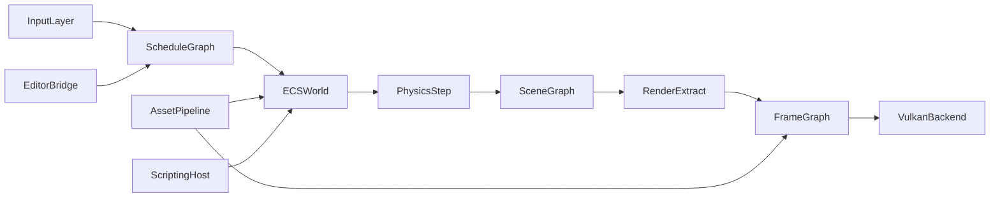
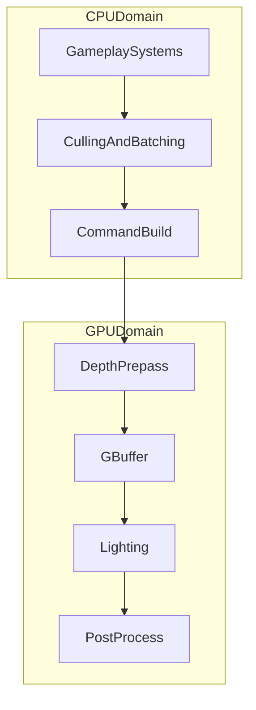

# Subsystem Diagrams

```mermaid
flowchart LR
  inputLayer[InputLayer] --> scheduleGraph[ScheduleGraph]
  scheduleGraph --> ecsWorld[ECSWorld]
  ecsWorld --> physicsStep[PhysicsStep]
  physicsStep --> sceneGraph[SceneGraph]
  sceneGraph --> renderExtract[RenderExtract]
  renderExtract --> frameGraph[FrameGraph]
  frameGraph --> vulkanBackend[VulkanBackend]
  assetPipeline[AssetPipeline] --> ecsWorld
  assetPipeline --> frameGraph
  scriptingHost[ScriptingHost] --> ecsWorld
  editorBridge[EditorBridge] --> scheduleGraph
```

```mermaid
flowchart TB
  subgraph cpuDomain [CPUDomain]
    gameSystems[GameplaySystems]
    culling[CullingAndBatching]
    commandBuild[CommandBuild]
  end
  subgraph gpuDomain [GPUDomain]
    depth[DepthPrepass]
    gbuffer[GBuffer]
    lighting[Lighting]
    post[PostProcess]
  end
  gameSystems --> culling --> commandBuild --> depth --> gbuffer --> lighting --> post
```
